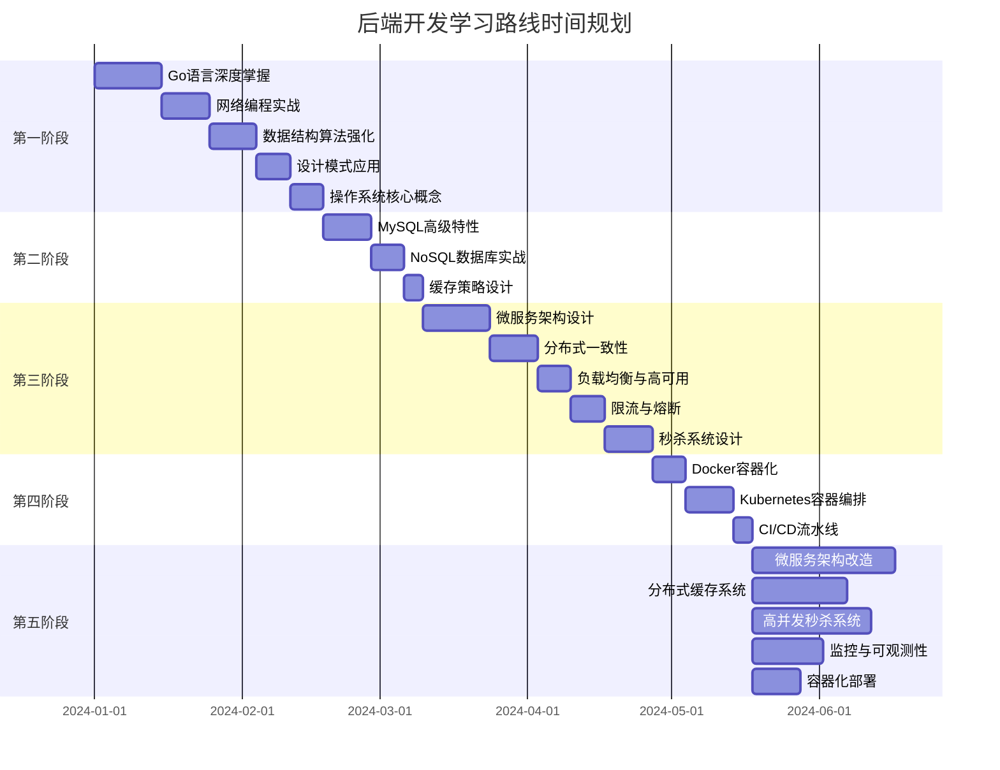

# 🎯 后端开发实习岗位学习路线总结

## 📊 岗位要求匹配度分析

### ✅ 必备技能对应
| 岗位要求 | 学习重点 | 在Ryan Mall中的实践 |
|---------|---------|-------------------|
| 扎实的编程能力 | Go语言深度掌握 | 重构现有代码，提升代码质量 |
| TCP/UDP网络编程 | 网络编程实战 | 实现gRPC服务间通信 |
| 数据结构算法 | 算法强化训练 | 优化搜索和排序算法 |
| 设计模式 | 23种模式实践 | 重构代码应用设计模式 |
| 数据库系统 | MySQL + NoSQL | 数据库性能优化 |

### 🚀 加分项技能
| 技能领域 | 学习内容 | 项目实践 |
|---------|---------|---------|
| 分布式系统 | 微服务架构、一致性算法 | 单体架构改造为微服务 |
| 负载均衡 | 算法实现、高可用设计 | 实现服务发现和负载均衡 |
| 云原生技术 | Docker + Kubernetes | 容器化部署整个系统 |

## 🗓️ 6个月学习时间线



## 🛠️ Ryan Mall项目实践路径

### 阶段一：基础优化（月1-2）
**目标**：在现有架构基础上进行优化

#### 1. 缓存系统集成
```go
// 商品缓存示例
type ProductCache struct {
    redis *redis.Client
    local *sync.Map
}

func (c *ProductCache) GetProduct(id uint) (*model.Product, error) {
    // L1: 本地缓存
    if value, ok := c.local.Load(fmt.Sprintf("product:%d", id)); ok {
        return value.(*model.Product), nil
    }
    
    // L2: Redis缓存
    key := fmt.Sprintf("product:%d", id)
    data, err := c.redis.Get(context.Background(), key).Result()
    if err == nil {
        var product model.Product
        json.Unmarshal([]byte(data), &product)
        c.local.Store(key, &product)
        return &product, nil
    }
    
    // L3: 数据库查询
    return c.getFromDB(id)
}
```

#### 2. 数据库性能优化
```sql
-- 关键索引优化
CREATE INDEX idx_product_category_status ON products(category_id, status);
CREATE INDEX idx_order_user_time ON orders(user_id, created_at DESC);
CREATE INDEX idx_cart_user_product ON cart_items(user_id, product_id);

-- 查询优化
EXPLAIN SELECT p.*, c.name as category_name 
FROM products p 
LEFT JOIN categories c ON p.category_id = c.id 
WHERE p.status = 1 AND p.stock > 0 
ORDER BY p.sales_count DESC 
LIMIT 20;
```

#### 3. API性能监控
```go
// 性能监控中间件
func PerformanceMiddleware() gin.HandlerFunc {
    return func(c *gin.Context) {
        start := time.Now()
        c.Next()
        
        latency := time.Since(start)
        if latency > 100*time.Millisecond {
            log.Printf("Slow API: %s %s took %v", 
                c.Request.Method, c.Request.URL.Path, latency)
        }
    }
}
```

### 阶段二：微服务改造（月3-4）
**目标**：拆分为微服务架构

#### 1. 服务拆分策略
```
单体架构 → 微服务架构

ryan-mall/                    microservices/
├── internal/                 ├── user-service/
│   ├── handler/             │   ├── main.go
│   │   ├── user_handler     │   ├── handler/
│   │   ├── product_handler  │   ├── service/
│   │   └── order_handler    │   └── repository/
│   ├── service/             ├── product-service/
│   └── repository/          ├── order-service/
└── main.go                  ├── payment-service/
                             └── api-gateway/
```

#### 2. gRPC服务实现
```protobuf
// user.proto
service UserService {
    rpc GetUser(GetUserRequest) returns (GetUserResponse);
    rpc ValidateToken(ValidateTokenRequest) returns (ValidateTokenResponse);
    rpc CreateUser(CreateUserRequest) returns (CreateUserResponse);
}

// product.proto  
service ProductService {
    rpc GetProduct(GetProductRequest) returns (GetProductResponse);
    rpc SearchProducts(SearchProductsRequest) returns (SearchProductsResponse);
    rpc UpdateStock(UpdateStockRequest) returns (UpdateStockResponse);
}
```

#### 3. 服务注册发现
```go
// 基于etcd的服务注册
type ServiceRegistry struct {
    client *clientv3.Client
}

func (r *ServiceRegistry) Register(serviceName, address string) error {
    key := fmt.Sprintf("/services/%s/%s", serviceName, address)
    lease, err := r.client.Grant(context.Background(), 30)
    if err != nil {
        return err
    }
    
    _, err = r.client.Put(context.Background(), key, address, clientv3.WithLease(lease.ID))
    return err
}
```

### 阶段三：高级特性（月5-6）
**目标**：实现高并发和高可用

#### 1. 分布式限流
```go
// Redis Lua脚本实现令牌桶
const tokenBucketScript = `
local key = KEYS[1]
local capacity = tonumber(ARGV[1])
local tokens = tonumber(ARGV[2])
local interval = tonumber(ARGV[3])

local bucket = redis.call('HMGET', key, 'tokens', 'last_refill')
local current_tokens = tonumber(bucket[1]) or capacity
local last_refill = tonumber(bucket[2]) or 0

local now = redis.call('TIME')[1]
local elapsed = now - last_refill

if elapsed > 0 then
    local new_tokens = math.min(capacity, current_tokens + (elapsed * tokens / interval))
    current_tokens = new_tokens
end

if current_tokens >= 1 then
    current_tokens = current_tokens - 1
    redis.call('HMSET', key, 'tokens', current_tokens, 'last_refill', now)
    redis.call('EXPIRE', key, interval * 2)
    return 1
else
    return 0
end
`
```

#### 2. 秒杀系统核心
```go
// 秒杀服务核心逻辑
func (s *SeckillService) ProcessSeckill(userID, productID uint64) error {
    // 1. 用户限制检查
    userKey := fmt.Sprintf("seckill:user:%d:%d", userID, productID)
    if s.redis.Exists(context.Background(), userKey).Val() > 0 {
        return errors.New("用户已参与")
    }
    
    // 2. 库存原子扣减
    stockKey := fmt.Sprintf("seckill:stock:%d", productID)
    remaining := s.redis.Decr(context.Background(), stockKey).Val()
    if remaining < 0 {
        s.redis.Incr(context.Background(), stockKey) // 回滚
        return errors.New("库存不足")
    }
    
    // 3. 设置用户参与标记
    s.redis.SetEX(context.Background(), userKey, "1", time.Hour)
    
    // 4. 异步创建订单
    return s.mq.Publish("seckill.order", SeckillOrder{
        UserID: userID, ProductID: productID,
    })
}
```

#### 3. 监控系统集成
```go
// Prometheus指标定义
var (
    httpRequestsTotal = prometheus.NewCounterVec(
        prometheus.CounterOpts{
            Name: "http_requests_total",
            Help: "Total number of HTTP requests",
        },
        []string{"method", "endpoint", "status"},
    )
    
    httpRequestDuration = prometheus.NewHistogramVec(
        prometheus.HistogramOpts{
            Name: "http_request_duration_seconds",
            Help: "HTTP request duration in seconds",
        },
        []string{"method", "endpoint"},
    )
)
```

## 📈 学习成果验证

### 技术能力检查清单
- [ ] **Go语言精通**：能够编写高质量的Go代码
- [ ] **网络编程**：熟练使用TCP/UDP、HTTP协议
- [ ] **数据库优化**：能够进行MySQL性能调优
- [ ] **缓存设计**：实现多级缓存系统
- [ ] **微服务架构**：能够设计和实现微服务系统
- [ ] **分布式系统**：理解CAP定理、一致性算法
- [ ] **高并发处理**：能够设计秒杀等高并发系统
- [ ] **容器化部署**：熟练使用Docker和Kubernetes
- [ ] **监控运维**：建立完整的监控体系

### 项目作品展示
1. **Ryan Mall微服务版本** - 完整的电商微服务系统
2. **高并发秒杀系统** - 支持万级QPS的秒杀功能
3. **分布式缓存系统** - 多级缓存架构
4. **容器化部署方案** - K8s部署配置

### 性能指标达成
- **API响应时间** < 100ms (P95)
- **系统QPS** > 10,000
- **缓存命中率** > 90%
- **系统可用性** > 99.9%

## 💼 面试准备要点

### 项目介绍模板
> "我主导开发了Ryan Mall电商系统，这是一个从单体架构演进到微服务架构的完整项目。系统包含用户管理、商品管理、订单处理、支付等核心功能。在项目中，我实现了分布式缓存、高并发秒杀、服务治理等技术方案，系统能够支持万级QPS，具备高可用和可扩展性。"

### 技术深度问题准备
1. **Go语言特性**：goroutine调度、GC机制、内存模型
2. **数据库优化**：索引原理、查询优化、事务隔离
3. **分布式系统**：CAP定理、一致性算法、分布式事务
4. **微服务架构**：服务拆分、通信方式、服务治理
5. **高并发设计**：限流算法、缓存策略、异步处理

### 系统设计题准备
- 设计一个分布式缓存系统
- 设计一个秒杀系统
- 设计一个消息队列
- 设计一个短链接服务

## 🎯 学习建议

### 学习方法
1. **理论与实践结合** - 每学一个概念就在项目中实践
2. **循序渐进** - 从简单到复杂，逐步深入
3. **持续总结** - 定期整理学习笔记和技术博客
4. **社区参与** - 参与开源项目，关注技术社区

### 时间管理
- **每日3-4小时** 专注学习时间
- **周末深度实践** 项目开发和技术探索
- **定期复习** 巩固已学知识
- **模拟面试** 检验学习成果

### 资源推荐
- **书籍**：《Go语言实战》、《设计数据密集型应用》
- **课程**：MIT 6.824分布式系统、极客时间Go语言核心
- **实践**：LeetCode算法、GitHub开源项目
- **社区**：Go语言中文网、掘金技术社区

通过这个系统性的学习路线，您将能够在6个月内达到后端开发实习岗位的要求，并具备较强的竞争优势。关键是要保持持续学习的态度，在Ryan Mall项目中不断实践和验证所学技术。
