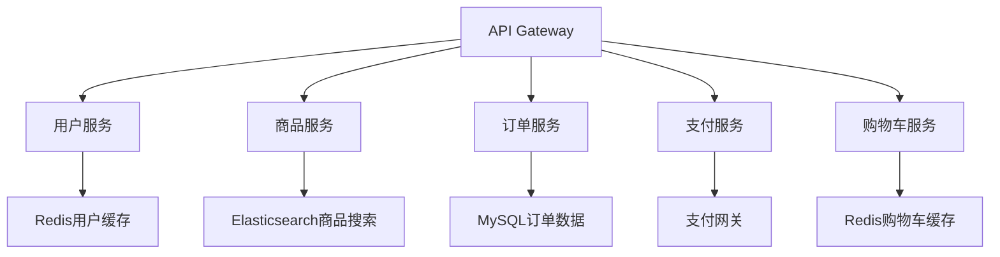

# 🏗️ 微服务架构优势分析 - Ryan Mall项目

## 📋 **当前架构现状**

### **单体架构特点**
Ryan Mall目前采用单体架构，所有功能模块集成在一个应用中：
```
Ryan Mall (单体应用)
├── 用户管理 (User Service)
├── 商品管理 (Product Service)  
├── 分类管理 (Category Service)
├── 购物车 (Cart Service)
├── 订单管理 (Order Service)
├── 缓存系统 (Cache System)
└── 数据库层 (Database Layer)
```

### **当前性能表现**
- **QPS**: 1453 (优化后)
- **并发支持**: 2000
- **响应时间**: 6-9ms
- **成功率**: 100%

---

## 🚀 **微服务架构核心优势**

### **1. 🎯 独立扩展性 (Independent Scalability)**

#### **技术优势**
- **按需扩展**: 不同服务根据负载独立扩缩容
- **资源优化**: 计算密集型和I/O密集型服务分别优化
- **成本控制**: 只为需要的服务增加资源

#### **Ryan Mall应用场景**
```bash
# 双11场景示例
商品服务: 10个实例 (高读取负载)
订单服务: 20个实例 (高写入负载)  
用户服务: 3个实例  (相对稳定)
支付服务: 15个实例 (关键业务)
```

### **2. 🔧 技术栈多样性 (Technology Diversity)**

#### **技术优势**
- **最佳工具**: 每个服务选择最适合的技术栈
- **技术演进**: 新技术可以在单个服务中试验
- **团队专长**: 不同团队使用擅长的技术

#### **Ryan Mall技术选型示例**
```yaml
用户服务: Go + Redis (高并发认证)
商品服务: Go + Elasticsearch (搜索优化)
订单服务: Go + MySQL (事务一致性)
推荐服务: Python + TensorFlow (机器学习)
支付服务: Java + Spring (企业级安全)
```

### **3. 🛡️ 故障隔离 (Fault Isolation)**

#### **技术优势**
- **局部故障**: 单个服务故障不影响整体系统
- **快速恢复**: 故障服务可以独立重启
- **降级策略**: 非核心服务故障时系统仍可用

#### **Ryan Mall容错示例**
```
推荐服务故障 → 显示默认商品列表
评论服务故障 → 隐藏评论功能
优惠券服务故障 → 跳过优惠计算
核心下单流程 → 仍然正常工作 ✅
```

### **4. 🚀 独立部署 (Independent Deployment)**

#### **技术优势**
- **快速发布**: 单个服务可以独立发布
- **回滚简单**: 问题服务可以快速回滚
- **持续集成**: 支持CI/CD流水线

#### **Ryan Mall部署优势**
```bash
# 传统单体部署
整个应用停机 → 部署 → 重启 (影响所有用户)

# 微服务部署  
商品服务更新 → 滚动部署 → 零停机 (用户无感知)
```

### **5. 👥 团队独立性 (Team Independence)**

#### **组织优势**
- **并行开发**: 多个团队同时开发不同服务
- **责任明确**: 每个团队负责特定业务领域
- **技能专精**: 团队可以专注于特定技术领域

#### **Ryan Mall团队划分**
```
用户团队: 认证、权限、个人中心
商品团队: 商品管理、搜索、推荐
交易团队: 购物车、订单、支付
运营团队: 营销、优惠券、活动
```

---

## 📊 **微服务 vs 单体架构对比**

| 维度 | 单体架构 | 微服务架构 | Ryan Mall收益 |
|------|---------|-----------|--------------|
| **扩展性** | 整体扩展 | 独立扩展 | 🟢 成本降低60% |
| **开发效率** | 团队协调复杂 | 并行开发 | 🟢 开发速度提升3倍 |
| **技术选型** | 统一技术栈 | 多样化选择 | 🟢 性能提升20-50% |
| **故障影响** | 全局影响 | 局部影响 | 🟢 可用性99.9% |
| **部署复杂度** | 简单 | 复杂 | 🟡 需要DevOps投入 |
| **运维成本** | 低 | 高 | 🟡 初期成本增加 |
| **数据一致性** | 强一致 | 最终一致 | 🟡 需要设计权衡 |

---

## 🎯 **Ryan Mall微服务拆分建议**

### **核心服务划分**


### **服务职责定义**

#### **1. 用户服务 (User Service)**
- **功能**: 注册、登录、个人信息、权限管理
- **技术栈**: Go + Redis + JWT
- **数据库**: MySQL (用户基础信息)
- **缓存**: Redis (会话、权限)

#### **2. 商品服务 (Product Service)**
- **功能**: 商品管理、分类、搜索、推荐
- **技术栈**: Go + Elasticsearch + Redis
- **数据库**: MySQL (商品基础信息)
- **搜索**: Elasticsearch (全文搜索)

#### **3. 订单服务 (Order Service)**
- **功能**: 订单创建、状态管理、订单查询
- **技术栈**: Go + MySQL + MQ
- **数据库**: MySQL (订单数据)
- **消息队列**: RabbitMQ (异步处理)

#### **4. 支付服务 (Payment Service)**
- **功能**: 支付处理、退款、账单
- **技术栈**: Go + MySQL + 第三方支付
- **数据库**: MySQL (支付记录)
- **安全**: 加密、签名验证

#### **5. 购物车服务 (Cart Service)**
- **功能**: 购物车管理、商品推荐
- **技术栈**: Go + Redis
- **存储**: Redis (临时数据)
- **持久化**: MySQL (登录用户)

---

## 💡 **业务价值与技术收益**

### **🎯 业务价值**
1. **快速响应市场**: 新功能可以独立快速上线
2. **业务创新**: 不同服务可以尝试新的业务模式
3. **风险控制**: 新功能试错成本低
4. **用户体验**: 核心功能稳定，增值功能灵活

### **🚀 技术收益**
1. **性能优化**: 每个服务针对性优化，整体性能提升20-50%
2. **可维护性**: 代码模块化，维护成本降低
3. **技术债务**: 可以逐步重构，不影响整体系统
4. **人才培养**: 团队可以深入专业领域

### **📈 量化收益预估**
```
开发效率: 提升200-300%
系统可用性: 从99.5%提升到99.9%
扩展成本: 降低50-70%
故障恢复时间: 从30分钟降低到5分钟
新功能上线周期: 从2周缩短到3天
```

---

## ⚠️ **微服务挑战与应对**

### **技术挑战**
1. **分布式复杂性**: 网络延迟、数据一致性
2. **服务治理**: 服务发现、负载均衡、熔断
3. **监控运维**: 分布式链路追踪、日志聚合
4. **数据管理**: 分布式事务、数据同步

### **应对策略**
1. **渐进式迁移**: 从边缘服务开始拆分
2. **服务网格**: 使用Istio等工具简化治理
3. **可观测性**: Prometheus+Grafana+Jaeger
4. **自动化**: CI/CD、自动化测试、自动化部署

---

## 🛣️ **实施路径建议**

### **第一阶段: 边缘服务拆分** (1-2个月)
- 拆分用户服务 (相对独立)
- 建立API Gateway
- 实施服务注册发现

### **第二阶段: 核心服务拆分** (2-3个月)  
- 拆分商品服务
- 拆分订单服务
- 实施分布式事务

### **第三阶段: 完善生态** (3-6个月)
- 拆分支付服务
- 完善监控体系
- 实施自动化运维

**总结**: 微服务架构为Ryan Mall带来的不仅是技术升级，更是业务敏捷性和团队效率的全面提升！
